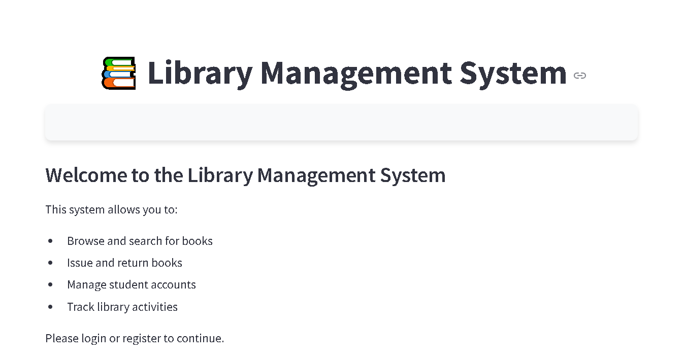

# Library Management System




A comprehensive Python-based application built with Streamlit that facilitates the management of library resources, user accounts, and book circulation. The system provides separate interfaces for administrators and students, allowing for efficient library operations without requiring a database server.

## Table of Contents

- [Features](#features)
- [Technology Stack](#technology-stack)
- [System Architecture](#system-architecture)
- [Installation](#installation)
- [Project Structure](#project-structure)
- [Data Models](#data-models)
- [User Roles](#user-roles)
- [Core Features](#core-features)
- [Future Enhancements](#future-enhancements)

## Features

- **User Authentication and Role-based Access Control**
  - Separate interfaces for administrators and students
  - Secure password hashing using SHA-256
  - Session management for access control

- **Book Inventory Management**
  - Add, update, and delete books
  - Support for multiple copies of the same book
  - Track availability status automatically

- **Book Circulation**
  - Request-approval workflow for book issuance and returns
  - Due date tracking and management
  - Automatic student flagging for late returns

- **Student Management**
  - Registration and approval workflow
  - Student flagging system for borrowing restrictions
  - Account status tracking

- **Analytics and Reporting**
  - Book inventory statistics
  - Student account statistics
  - Circulation activity reports

- **Data Integrity**
  - Comprehensive error handling
  - Data validation at multiple levels
  - Relationship maintenance between data files

## Technology Stack

- **Programming Language**: Python 3.x
- **Frontend Framework**: Streamlit
- **Data Storage**: JSON files
- **Data Processing**: Pandas
- **Date Handling**: Python datetime module
- **Authentication**: SHA-256 hashing

## System Architecture

The Library Management System follows a modular architecture with clear separation of concerns:

1. **Main Application (app.py)**: Entry point that initializes the system and manages session state
2. **Authentication Module**: Handles user login, registration, and session management
3. **File Handler Service**: Core service for data operations and business logic
4. **Page Router**: Manages navigation between different pages based on user role
5. **Admin Dashboard**: Interface for administrative functions
6. **Student Dashboard**: Interface for student interactions
7. **Data Files**: JSON-based storage for all system data

## Installation

1. Clone the repository:
   ```bash
   git clone https://github.com/Ehtisham1053/library-management-system.git
   cd library-management-system
